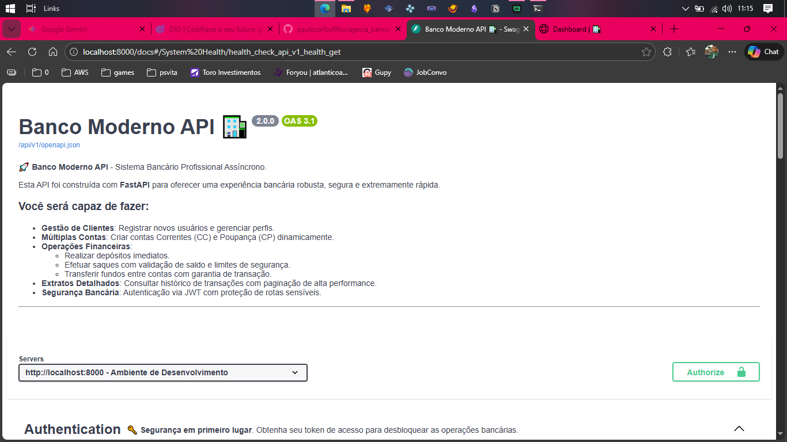
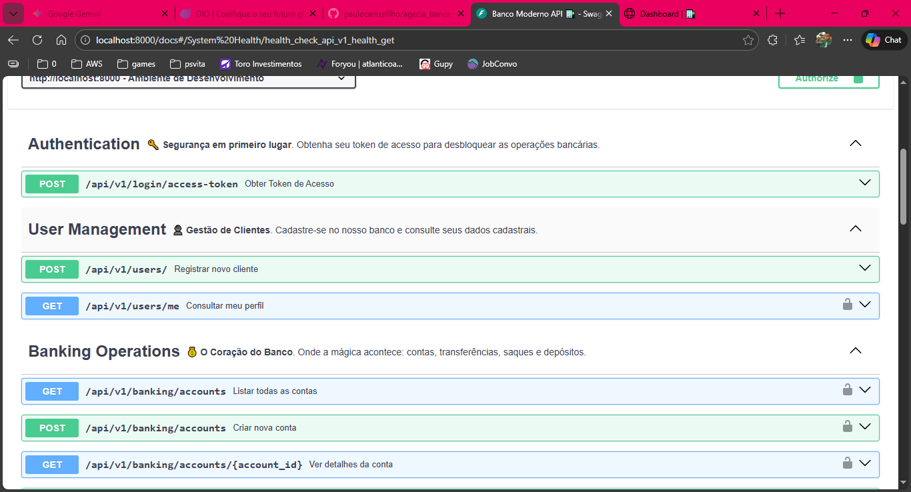
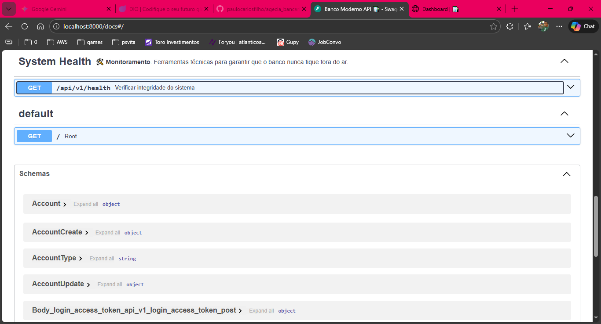
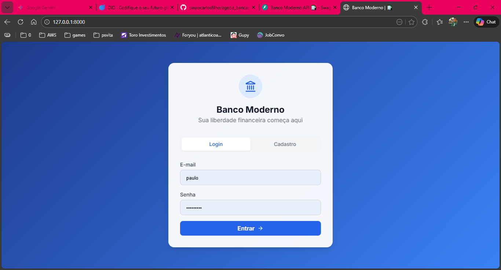
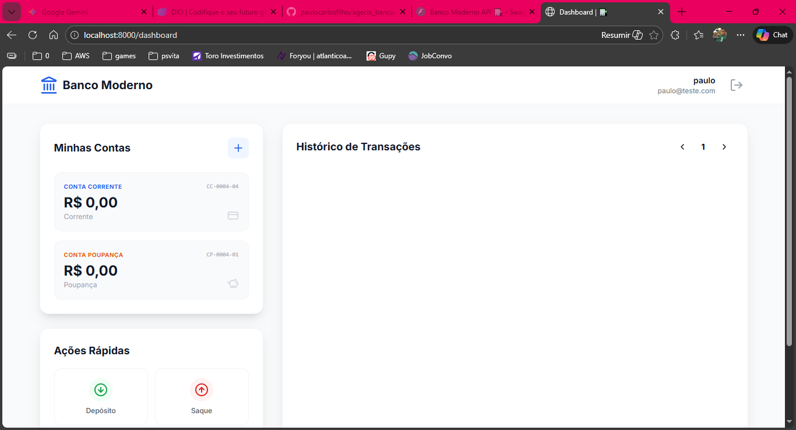

# 🏦 Banco Moderno API - Sistema Bancário Full Stack Profissional

[](https://fastapi.tiangolo.com/)
[](https://www.sqlalchemy.org/)
[](https://www.sqlite.org/)
[](https://tailwindcss.com/)
[](https://jinja.palletsprojects.com/)

Este é um projeto de sistema bancário de alto nível, desenvolvido com foco em performance, segurança e escalabilidade. O sistema oferece uma API robusta utilizando **FastAPI** e uma interface de usuário moderna, responsiva e elegante.

---

## 📸 Screenshots do Sistema

### **Backend & API**
Aqui você pode ver a robustez da nossa API documentada e as operações de banco de dados.

<div align="center">
  
  <br><br>
  
  <br><br>
  
</div>

### **Frontend & Interface**
Uma interface moderna, limpa e focada na experiência do usuário.

<div align="center">
  
  <br><br>
  
</div>

---

## 🏆 Desafio vs. Entrega Profissional

Este projeto foi além dos requisitos básicos de um desafio técnico comum, implementando padrões de arquitetura e segurança utilizados em sistemas de produção.

| Funcionalidade | Requisito Básico (Comum) | **Entrega (Este Projeto)** |
| :--- | :--- | :--- |
| **Arquitetura** | Script único ou rotas simples | **Service Layer Pattern**: Separação clara de responsabilidades. |
| **Concorrência** | Execução Síncrona | **100% Async/Await**: Alta performance e escalabilidade. |
| **Segurança** | Autenticação simples ou inexistente | **JWT + bcrypt**: Proteção robusta de dados e rotas. |
| **Gestão de Contas** | Apenas uma conta por usuário | **Múltiplas Contas**: Suporte a Conta Corrente e Poupança. |
| **Persistência** | Dados em memória (Dicionários) | **SQLAlchemy 2.0 + SQLite**: Banco de dados relacional real. |
| **Documentação** | Swagger padrão e vazio | **Swagger Customizado**: Exemplos reais e tags organizadas. |
| **Interface** | Apenas via Terminal/Postman | **Frontend Full Stack**: Dashboard moderno e responsivo. |

---

## 🚀 Funcionalidades Principais

### **Gestão de Usuários & Segurança**
*   **Autenticação JWT (OAuth2)**: Fluxo de segurança profissional com tokens de acesso e expiração.
*   **Password Hashing**: Utiliza `bcrypt` com proteção contra ataques de dicionário.
*   **CORS & Security Middlewares**: Configurado para proteção contra ataques comuns da web.

### **Operações Bancárias (Assíncronas)**
*   **Múltiplas Contas**: Suporte dinâmico para Conta Corrente (CC) e Conta Poupança (CP) no mesmo perfil.
*   **Transações Seguras**: Depósitos, saques e transferências com integridade referencial garantida pelo SQLAlchemy.
*   **Validações de Negócio Sênior**: Bloqueio de contas inativas, verificação de saldo em tempo real e limites de segurança.
*   **Extrato Inteligente**: Histórico de transações com paginação de alta performance.

### **Interface (Frontend)**
*   **Dashboard Moderno**: Interface construída com **Tailwind CSS** e **Lucide Icons**.
*   **Experiência SPA-like**: Consumo de API via Fetch API (AJAX) para navegação sem refresh.
*   **Feedback Visual**: Tratamento de erros amigável e notificações de sucesso.

---

## 🛠️ Stack Tecnológica

*   **Backend**: Python 3.10+, FastAPI, SQLAlchemy 2.0 (Async), Pydantic v2.
*   **Banco de Dados**: SQLite (Assíncrono via `aiosqlite`).
*   **Frontend**: HTML5, Jinja2 Templates, Tailwind CSS, JavaScript (ES6+).
*   **Automação**: Makefile para gestão de ambiente e dependências.

---

## 📦 Como Executar

O projeto utiliza um **Makefile** para simplificar o setup. Siga os passos:

1.  **Instalar dependências**:
    ```bash
    make install
    ```

2.  **Preparar o Banco de Dados (Opcional - se quiser começar do zero)**:
    ```bash
    make db-reset
    ```

3.  **Iniciar o servidor**:
    ```bash
    make run
    ```
    O sistema estará disponível em: [http://127.0.0.1:8000](http://127.0.0.1:8000)

### 🐳 Rodando com Docker

Se você tiver o Docker instalado, pode subir o sistema completo sem precisar configurar o Python localmente:

1.  **Construir e Iniciar**:
    ```bash
    make docker-build
    make docker-up
    ```
    O sistema estará disponível no mesmo endereço: [http://127.0.0.1:8000](http://127.0.0.1:8000)

2.  **Parar os Containers**:
    ```bash
    make docker-down
    ```

4.  **Documentação Técnica (Swagger)**:
    Explore todos os endpoints em: [http://127.0.0.1:8000/docs](http://127.0.0.1:8000/docs)

---

## 🏗️ Arquitetura do Projeto

```text
├── app/
│   ├── api/            # Endpoints da API (v1) organizados por módulos
│   ├── core/           # Configurações de segurança (JWT, Hashing)
│   ├── db/             # Engine e Sessão assíncrona do Banco de Dados
│   ├── models/         # Modelos de dados (User, Account, Transaction)
│   ├── schemas/        # Contratos de entrada/saída (Pydantic)
│   ├── services/       # Service Layer (Onde reside a regra de negócio)
│   ├── static/         # Assets estáticos (CSS customizado, JS modular)
│   └── templates/      # Templates HTML organizados por contextos (Auth, Dashboard)
├── tests/              # Testes de integração automatizados
├── main.py             # Configuração do App e Injeção de dependências
├── Makefile            # Comandos de automação do projeto
└── requirements.txt    # Lista rigorosa de dependências
```

---
*Desenvolvido como uma demonstração de excelência técnica em Python e Engenharia de Software.*
